# Домашнее задание к занятию 11 «Teamcity»

## Подготовка к выполнению

1. В Yandex Cloud создайте новый инстанс (4CPU4RAM) на основе образа `jetbrains/teamcity-server`.
2. Дождитесь запуска teamcity, выполните первоначальную настройку.
3. Создайте ещё один инстанс (2CPU4RAM) на основе образа `jetbrains/teamcity-agent`. Пропишите к нему переменную окружения `SERVER_URL: "http://<teamcity_url>:8111"`.
4. Авторизуйте агент.
5. Сделайте fork [репозитория](https://github.com/aragastmatb/example-teamcity).
6. Создайте VM (2CPU4RAM) и запустите [playbook](./infrastructure).

## Основная часть

1. Создайте новый проект в teamcity на основе fork.
2. Сделайте autodetect конфигурации.
3. Сохраните необходимые шаги, запустите первую сборку master.
4. Поменяйте условия сборки: если сборка по ветке `master`, то должен происходит `mvn clean deploy`, иначе `mvn clean test`.
5. Для deploy будет необходимо загрузить [settings.xml](./teamcity/settings.xml) в набор конфигураций maven у teamcity, предварительно записав туда креды для подключения к nexus.
6. В pom.xml необходимо поменять ссылки на репозиторий и nexus.
7. Запустите сборку по master, убедитесь, что всё прошло успешно и артефакт появился в nexus.
8. Мигрируйте `build configuration` в репозиторий.
9. Создайте отдельную ветку `feature/add_reply` в репозитории.
10. Напишите новый метод для класса Welcomer: метод должен возвращать произвольную реплику, содержащую слово `hunter`.
11. Дополните тест для нового метода на поиск слова `hunter` в новой реплике.
12. Сделайте push всех изменений в новую ветку репозитория.
13. Убедитесь, что сборка самостоятельно запустилась, тесты прошли успешно.
14. Внесите изменения из произвольной ветки `feature/add_reply` в `master` через `Merge`.
15. Убедитесь, что нет собранного артефакта в сборке по ветке `master`.
16. Настройте конфигурацию так, чтобы она собирала `.jar` в артефакты сборки.
17. Проведите повторную сборку мастера, убедитесь, что сбора прошла успешно и артефакты собраны.
18. Проверьте, что конфигурация в репозитории содержит все настройки конфигурации из teamcity.
19. В ответе пришлите ссылку на репозиторий.

---

## Ответы к подготовительной части

1. В Yandex Cloud создайте новый инстанс (4CPU4RAM) на основе образа `jetbrains/teamcity-server`.
2. Дождитесь запуска teamcity, выполните первоначальную настройку.
3. Создайте ещё один инстанс (2CPU4RAM) на основе образа `jetbrains/teamcity-agent`. Пропишите к нему переменную окружения `SERVER_URL: "http://<teamcity_url>:8111"`.
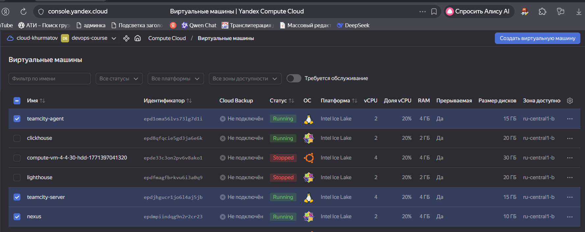

4. Авторизуйте агент.
5. Сделайте fork [репозитория](https://github.com/aragastmatb/example-teamcity).
6. Создайте VM (2CPU4RAM) и запустите [playbook](./infrastructure).
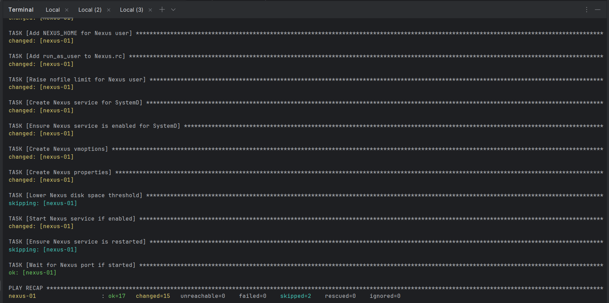

## Ответы к основной части

1. Создайте новый проект в teamcity на основе fork.
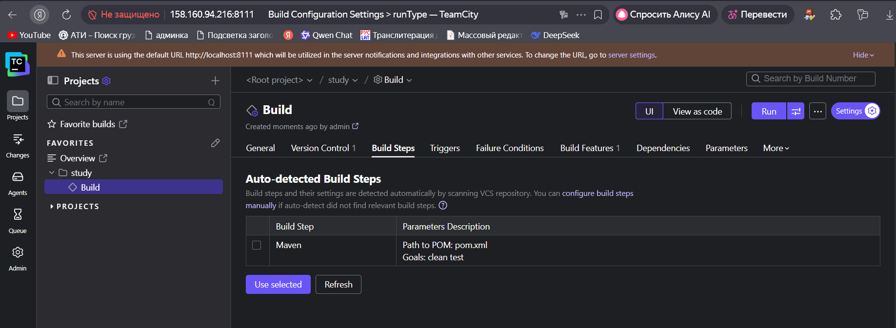

2. Сделайте autodetect конфигурации.
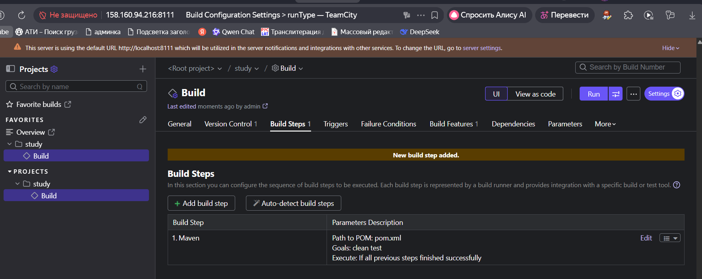

3. Сохраните необходимые шаги, запустите первую сборку master.
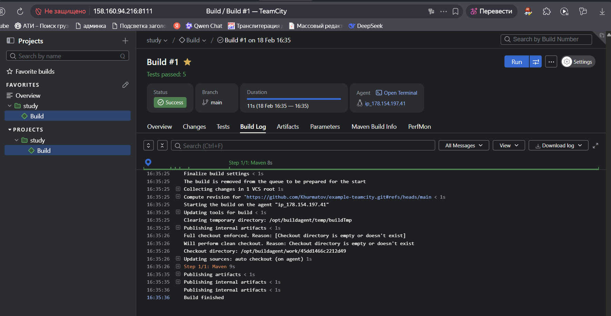

4. Поменяйте условия сборки: если сборка по ветке `master`, то должен происходит `mvn clean deploy`, иначе `mvn clean test`.
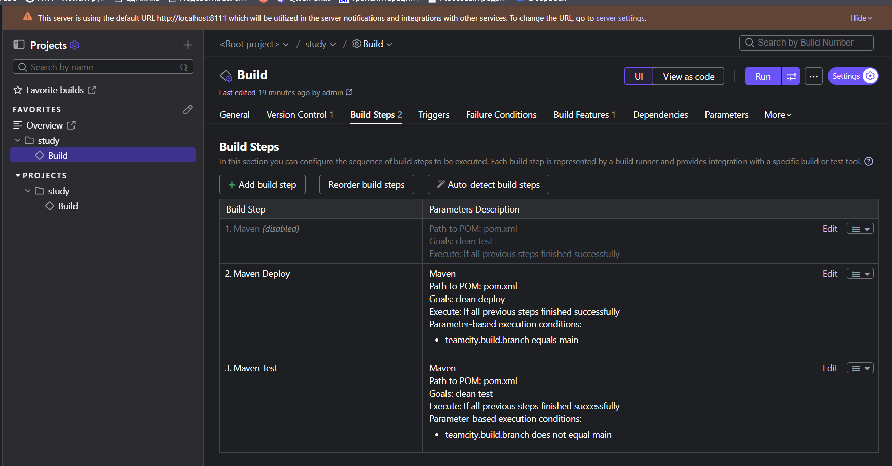

5. Для deploy будет необходимо загрузить [settings.xml](./teamcity/settings.xml) в набор конфигураций maven у teamcity, предварительно записав туда креды для подключения к nexus.
```declarative
<server>
  <id>nexus</id>
  <username>admin</username>
  <password>admin123</password>
</server>
```

6. В pom.xml необходимо поменять ссылки на репозиторий и nexus.
```declarative
<distributionManagement>
		<repository>
				<id>nexus</id>
				<url>http://178.154.193.211:8081/repository/maven-releases</url>
		</repository>
	</distributionManagement>
```

7. Запустите сборку по master, убедитесь, что всё прошло успешно и артефакт появился в nexus.


8. Мигрируйте `build configuration` в репозиторий.
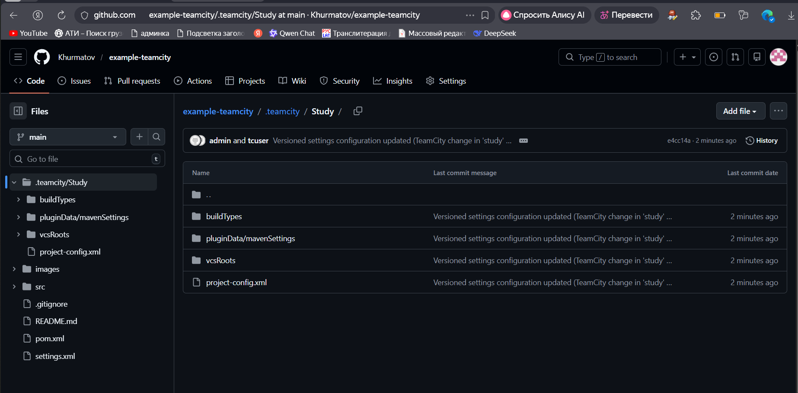

9. Создайте отдельную ветку `feature/add_reply` в репозитории.
Выполнено

10. Напишите новый метод для класса Welcomer: метод должен возвращать произвольную реплику, содержащую слово `hunter`.
```declarative
public String sayRandomHunterPhrase() {
    String[] phrases = {
            "The hunter must hunt.",
            "A hunter is never alone.",
            "The hunter's dream is eternal.",
            "This hunter's mark is your own.",
            "Every hunter fears the night."
    };

    int index = random.nextInt(phrases.length);
    return phrases[index];
}
```

11. Дополните тест для нового метода на поиск слова `hunter` в новой реплике.
```declarative
@Test
public void welcomerSaysRandomHunterPhrase() {
    String phrase = welcomer.sayRandomHunterPhrase();
    // Проверяем, что фраза содержит слово "hunter"
    assertThat(phrase.toLowerCase(), containsString("hunter"));
    // Проверяем, что фраза не пустая
    assertTrue(phrase.length() > 0);
}

// Дополнительный тест для проверки случайности
@Test
public void randomHunterPhraseIsRandom() {
    String firstPhrase = welcomer.sayRandomHunterPhrase();
    boolean foundDifferent = false;

    // Пробуем несколько раз получить другую фразу
    for (int i = 0; i < 10; i++) {
        if (!welcomer.sayRandomHunterPhrase().equals(firstPhrase)) {
            foundDifferent = true;
            break;
        }
    }

    // Если мы не нашли другой фразы за 10 попыток, возможно, что-то не так
    // Но теоретически может выпадать одна и та же фраза, поэтому тест может иногда падать
    // Можно закомментировать, если мешает
    // assertTrue("Метод должен возвращать разные фразы", foundDifferent);
}
```

12. Сделайте push всех изменений в новую ветку репозитория.
Выполнено
13. Убедитесь, что сборка самостоятельно запустилась, тесты прошли успешно.
Сборка сама не запустилась, так как триггер не был настроен
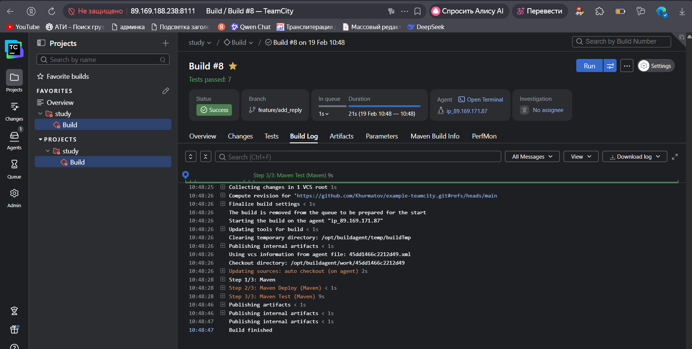

14. Внесите изменения из произвольной ветки `feature/add_reply` в `master` через `Merge`.
Выполнено

15. Убедитесь, что нет собранного артефакта в сборке по ветке `master`.
После сборки билда в тестовой ветке, в мастере билдов нет
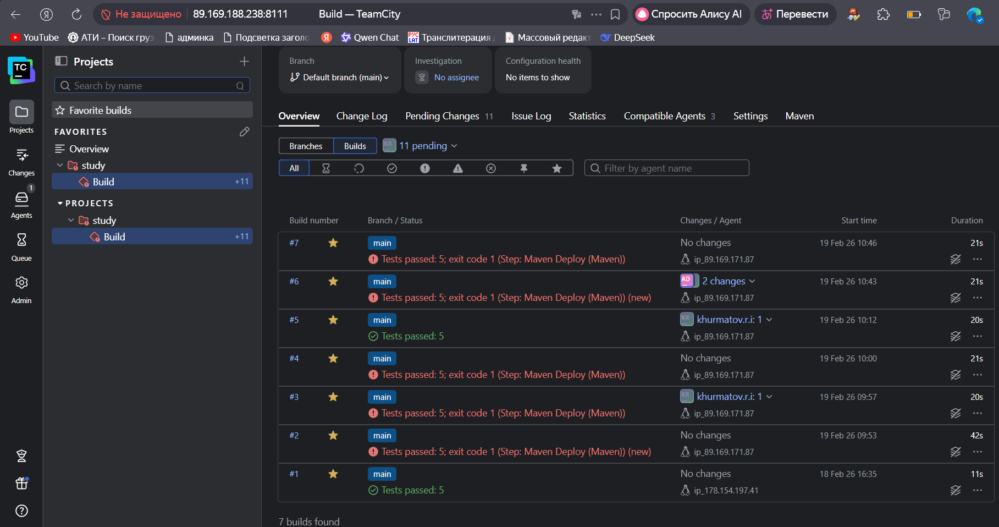

16. Настройте конфигурацию так, чтобы она собирала `.jar` в артефакты сборки.
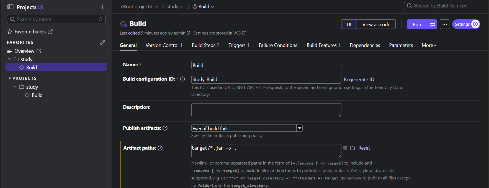

17. Проведите повторную сборку мастера, убедитесь, что сбора прошла успешно и артефакты собраны.
Добавил триггер на измнения, билд сам запустился
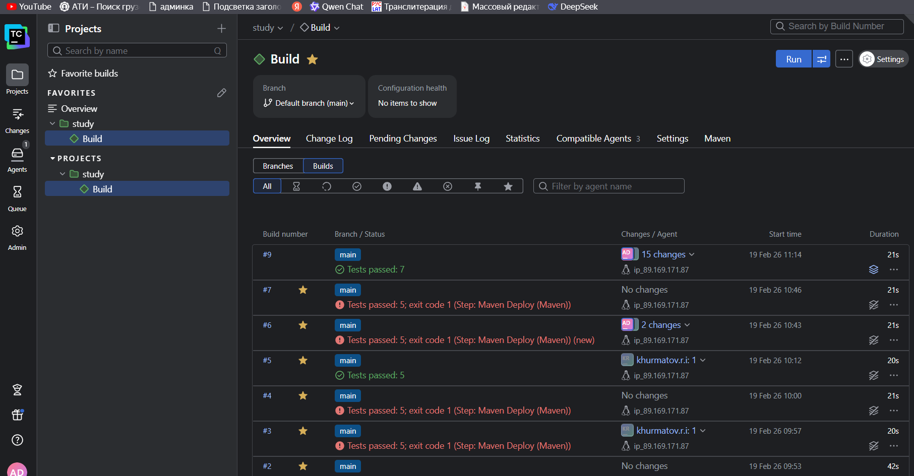
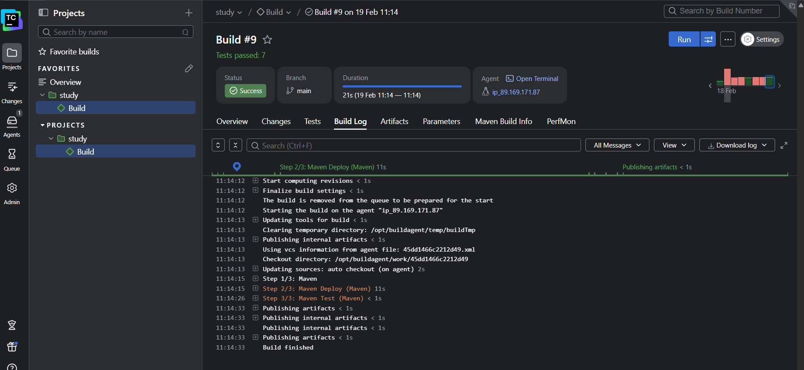
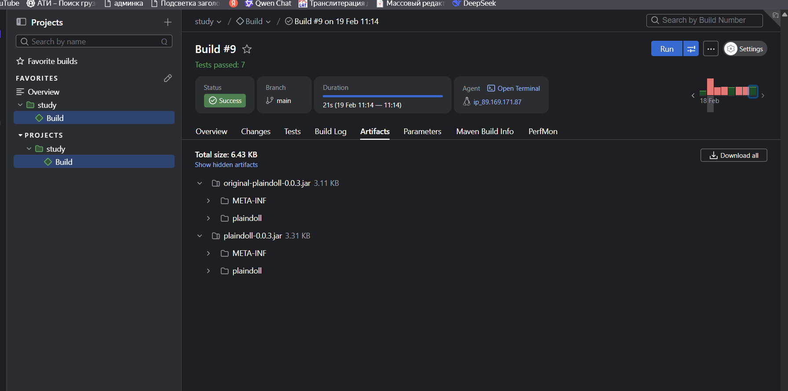

18. Проверьте, что конфигурация в репозитории содержит все настройки конфигурации из teamcity.
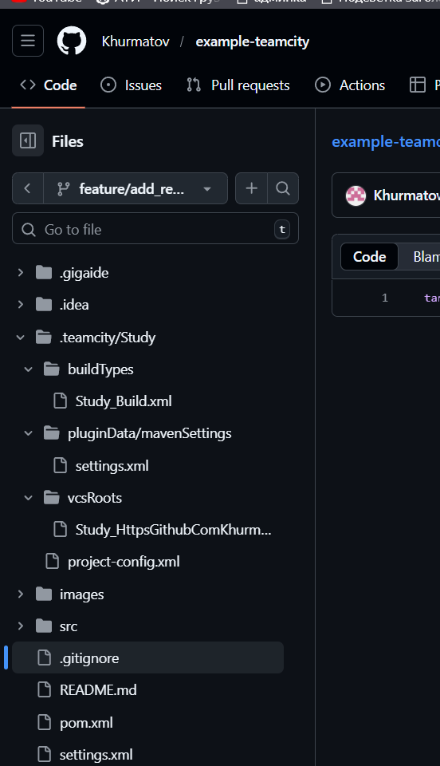

19. В ответе пришлите ссылку на репозиторий.
https://github.com/Khurmatov/example-teamcity

### Как оформить решение задания

Выполненное домашнее задание пришлите в виде ссылки на .md-файл в вашем репозитории.

---
